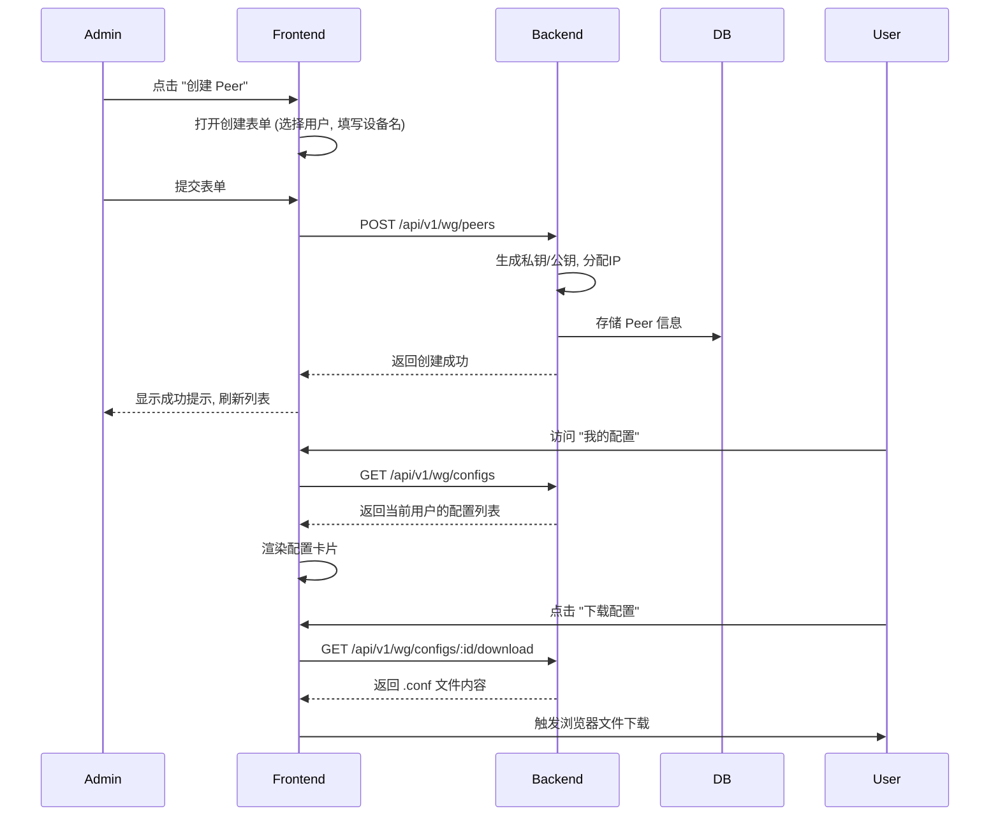

# WireGuard 管理平台 UI 设计规范

## 1. 概述 (Overview)
本设计规范旨在为 WireGuard 管理平台提供一套清晰、统一且现代化的用户界面设计指南。平台采用 Golang 后端与 React 前端技术栈，旨在为管理员和普通用户提供高效的 VPN 管理体验。

## 2. 视觉设计体系 (Visual Design System)

### 2.1 色彩方案 (Color Scheme)
基于 Ant Design 默认色系进行定制，体现科技感与安全性。

#### 主色调 (Primary)
- **Deep Blue**: `#1890ff` (用于按钮、链接、高亮状态)
- **Hover State**: `#40a9ff`
- **Active State**: `#096dd9`

#### 辅助色 (Secondary)
- **Success (Green)**: `#52c41a` (用于运行中状态、成功提示)
- **Warning (Orange)**: `#faad14` (用于暂停、注意提示)
- **Error (Red)**: `#ff4d4f` (用于停止、删除、错误提示)
- **Info (Blue)**: `#1890ff` (用于一般信息)

#### 中性色 (Neutrals)
- **Text Primary**: `rgba(0, 0, 0, 0.85)` (主要文字)
- **Text Secondary**: `rgba(0, 0, 0, 0.65)` (次要文字、标签)
- **Text Disabled**: `rgba(0, 0, 0, 0.25)` (禁用文字)
- **Border**: `#d9d9d9` (边框)
- **Background Base**: `#f0f2f5` (页面背景)
- **Background Component**: `#ffffff` (卡片、弹窗背景)
- **Sidebar Background**: `#001529` (侧边栏深色背景)

### 2.2 字体 (Typography)
- **Font Family**: `-apple-system, BlinkMacSystemFont, 'Segoe UI', Roboto, 'Helvetica Neue', Arial, 'Noto Sans', sans-serif`
- **Base Size**: `14px`

### 2.3 响应式断点 (Responsive Breakpoints)
- **Mobile (xs)**: `< 576px` (单栏布局，隐藏侧边栏为抽屉)
- **Tablet (md)**: `≥ 768px` (双栏布局，侧边栏折叠)
- **Desktop (lg)**: `≥ 992px` (完整布局)
- **Wide (xl)**: `≥ 1200px`

## 3. UI 组件库 (UI Components)
推荐使用 **Ant Design (v5)** 作为基础组件库。

### 核心组件使用规范
1.  **Layout**: 使用 `ProLayout` 或 Antd Grid 系统实现响应式框架。
2.  **Table**: 用于展示用户列表和 Peer 列表，需支持分页、排序、筛选。
    *   *Mobile适配*: 小屏幕下转化为卡片列表 (`List` 组件) 或横向滚动表格。
3.  **Form**: 使用 `ProForm` 或 Antd Form，统一校验反馈风格。
4.  **Modal/Drawer**:
    *   简单表单/确认操作使用 `Modal`。
    *   复杂详情/长表单使用 `Drawer`（右侧滑出）。
5.  **Feedback**: 操作反馈必须使用 `message.success/error` 全局提示。
6.  **Icons**: 使用 `@ant-design/icons`。

---

## 4. 页面线框图 (Wireframes)

### 4.1 登录页 (Login Page)
**路由**: `/login`
**适用角色**: 所有用户

```
+-------------------------------------------------------+
|                                                       |
|   [ Logo ] NexusPoint WG                              |
|                                                       |
|   +-----------------------------------------------+   |
|   |  登录                                         |   |
|   |                                               |   |
|   |  用户: [ 请输入用户名/邮箱                 ]  |   |
|   |                                               |   |
|   |  密码: [ 请输入密码                        ]  |   |
|   |                                               |   |
|   |  [ ] 记住我                    忘记密码?      |   |
|   |                                               |   |
|   |  [          登    录 (Primary)           ]   |   |
|   |                                               |   |
|   |  还没有账号? [ 立即注册 ]                     |   |
|   +-----------------------------------------------+   |
|                                                       |
|   Copyright © 2024 NexusPoint WG                      |
+-------------------------------------------------------+
```

### 4.2 Admin 控制台 (Admin Dashboard)
**路由**: `/admin/dashboard`
**适用角色**: Admin

```
+----------------------+--------------------------------------------------+
| Logo   NexusPoint    |  [Menu Collapse]          [User Avatar v]        |
+----------------------+--------------------------------------------------+
| [ Dashboard      ]   |  Dashboard                                       |
| [ 用户管理       ]   |                                                  |
| [ Peer 管理      ]   |  +----------+  +----------+  +----------+        |
| [ 系统设置       ]   |  | 用户总数 |  | 活跃Peer |  | 流量消耗 |        |
|                      |  |   128    |  |    42    |  |  1.2 TB  |        |
|                      |  +----------+  +----------+  +----------+        |
|                      |                                                  |
|                      |  +--------------------------------------------+  |
|                      |  |  系统状态 (System Status)                  |  |
|                      |  |  CPU: [||||||....] 60%                     |  |
|                      |  |  RAM: [||||......] 40%                     |  |
|                      |  +--------------------------------------------+  |
|                      |                                                  |
|                      |  +--------------------------------------------+  |
|                      |  |  最近活动                                  |  |
|                      |  |  - User A created peer (10 mins ago)       |  |
|                      |  |  - User B updated profile (1 hour ago)     |  |
|                      |  +--------------------------------------------+  |
+----------------------+--------------------------------------------------+
```

### 4.3 用户管理 (User Management)
**路由**: `/admin/users`
**适用角色**: Admin

```
+-------------------------------------------------------------------------+
| 用户管理                                                                |
+-------------------------------------------------------------------------+
| [ 搜索用户名/邮箱... ]   Filter: [ 全部角色 v ]   [ + 添加用户(Primary) ]|
+-------------------------------------------------------------------------+
|                                                                         |
|  用户列表                                                               |
|  +--------+----------+--------------------+-------+--------+---------+  |
|  | 头像   | 用户名   | 邮箱               | 角色  | 状态   | 操作    |  |
|  +--------+----------+--------------------+-------+--------+---------+  |
|  | (img)  | alice    | alice@example.com  | User  | Active | [Edit]  |  |
|  |        |          |                    |       |        | [Del ]  |  |
|  +--------+----------+--------------------+-------+--------+---------+  |
|  | (img)  | bob      | bob@example.com    | Admin | Active | [Edit]  |  |
|  +--------+----------+--------------------+-------+--------+---------+  |
|                                                                         |
|  < Prev  1  2  3  Next >                                                |
+-------------------------------------------------------------------------+
```
*注: "添加/编辑用户" 使用 Modal 弹窗，包含字段: 用户名、昵称、邮箱、密码(仅创建/重置)、角色、状态。*

### 4.4 Peer 管理 (Peer Management)
**路由**: `/admin/peers`
**适用角色**: Admin

```
+-------------------------------------------------------------------------+
| Peer 配置管理                                                           |
+-------------------------------------------------------------------------+
| [ 搜索 Peer... ]     [ + 创建 Peer ]                                    |
+-------------------------------------------------------------------------+
|                                                                         |
|  +------------------+  +------------------+  +------------------+       |
|  | Peer: laptop-01  |  | Peer: phone-X    |  | Peer: server-1   |       |
|  | User: alice      |  | User: bob        |  | User: admin      |       |
|  | IP: 10.10.0.2/32 |  | IP: 10.10.0.3/32 |  | IP: 10.10.0.4/32 |       |
|  | Last: 2m ago     |  | Last: 2d ago     |  | Last: Online     |       |
|  | Status: [OK]     |  | Status: [Off]    |  | Status: [OK]     |       |
|  |                  |  |                  |  |                  |       |
|  | [View] [Revoke]  |  | [View] [Revoke]  |  | [View] [Revoke]  |       |
|  +------------------+  +------------------+  +------------------+       |
|                                                                         |
+-------------------------------------------------------------------------+
```

### 4.5 User 控制台 & 配置下载 (User Dashboard)
**路由**: `/user/dashboard`
**适用角色**: User

```
+----------------------+--------------------------------------------------+
| Logo                 |  [Menu]                   [User Avatar v]        |
+----------------------+--------------------------------------------------+
| [ 我的配置       ]   |  我的配置 (My Configurations)                    |
| [ 个人中心       ]   |                                                  |
|                      |  您当前有 2 个可用的 WireGuard 配置                |
|                      |                                                  |
|                      |  +--------------------------------------------+  |
|                      |  | 💻  Work Laptop                             |  |
|                      |  |     IP: 10.10.0.5/32                         |  |
|                      |  |     Endpoint: vpn.example.com:51820          |  |
|                      |  |     Public Key: xxxxxxxxx...                 |  |
|                      |  |                                              |  |
|                      |  |     [ 下载配置 (.conf) ]  [ 显示二维码 ]      |  |
|                      |  +--------------------------------------------+  |
|                      |                                                  |
|                      |  +--------------------------------------------+  |
|                      |  | 📱  iPhone 13                               |  |
|                      |  |     ...                                      |  |
|                      |  +--------------------------------------------+  |
|                      |                                                  |
+----------------------+--------------------------------------------------+
```

### 4.6 个人中心 (Profile & Password)
**路由**: `/user/profile`

```
+-------------------------------------------------------+
| 个人信息                                              |
|                                                       |
|  [ 头像 (Upload) ]                                    |
|                                                       |
|  用户名:    user1 (Read-only)                         |
|  昵称:      [ Super User     ]                        |
|  邮箱:      [ user1@test.com ]                        |
|                                                       |
|  [ 保存修改 ]                                         |
|                                                       |
+-------------------------------------------------------+
| 修改密码                                              |
|                                                       |
|  当前密码:  [ ............ ]                          |
|  新密码:    [ ............ ]                          |
|  确认密码:  [ ............ ]                          |
|                                                       |
|  [ 修改密码 ]                                         |
+-------------------------------------------------------+
```

---

## 5. 交互流程 (Interaction Flows)

### 5.1 配置下发与下载流程


### 5.2 用户注册与审核流程
```mermaid
flowchart TD
    A[访客访问注册页] --> B(填写注册信息);
    B --> C{提交注册};
    C -->|校验失败| B;
    C -->|校验通过| D[后端创建用户 status=inactive];
    D --> E[提示用户: 等待管理员审核];
    
    F[Admin 登录] --> G[进入用户管理];
    G --> H[筛选 inactive 用户];
    H --> I[点击 "编辑"];
    I --> J[修改 status = active];
    J --> K[保存];
    K --> L[用户可登录];
```

---

## 6. 前端项目结构 (Project Structure)

建议在 `ui/` 目录下构建 React 项目，推荐使用 Vite。

```
ui/
├── index.html
├── package.json
├── vite.config.ts
├── public/
│   └── logo.svg
└── src/
    ├── App.tsx             # 根组件
    ├── main.tsx            # 入口文件
    ├── api/                # API 接口定义
    │   ├── auth.ts
    │   ├── user.ts
    │   └── peer.ts
    ├── assets/             # 静态资源
    ├── components/         # 通用组件
    │   ├── Layout/         # 布局组件 (Header, Sidebar)
    │   ├── Guard/          # 路由守卫
    │   └── Common/         # 原子组件
    ├── config/             # 全局配置
    ├── contexts/           # React Context (AuthContext)
    ├── hooks/              # 自定义 Hooks
    ├── pages/              # 页面组件
    │   ├── Login/
    │   ├── Admin/
    │   │   ├── Dashboard/
    │   │   ├── Users/
    │   │   └── Peers/
    │   └── User/
    │       ├── Dashboard/
    │       └── Profile/
    ├── router/             # 路由配置
    ├── styles/             # 全局样式
    ├── types/              # TypeScript 类型定义
    └── utils/              # 工具函数 (request, validation)
```

## 7. 推荐依赖 (Dependencies)

-   **Core**: `react`, `react-dom`
-   **Build Tool**: `vite`
-   **Routing**: `react-router-dom`
-   **UI Library**: `antd`, `@ant-design/icons`
-   **HTTP Client**: `axios`
-   **State Management**: `zustand` (轻量级) 或 `useContext`
-   **Data Fetching**: `swr` or `react-query` (推荐)
-   **Utilities**: `lodash`, `dayjs` (日期处理), `clsx` (类名处理)


