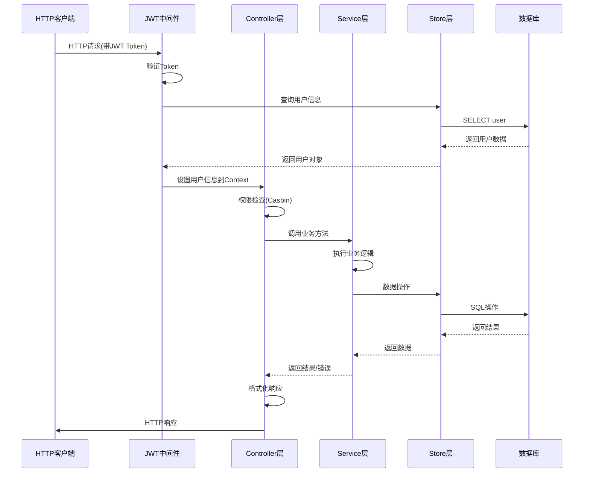
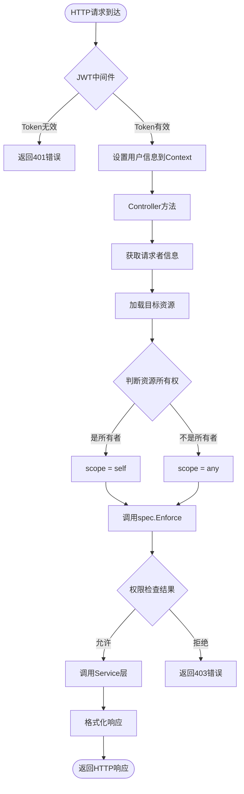
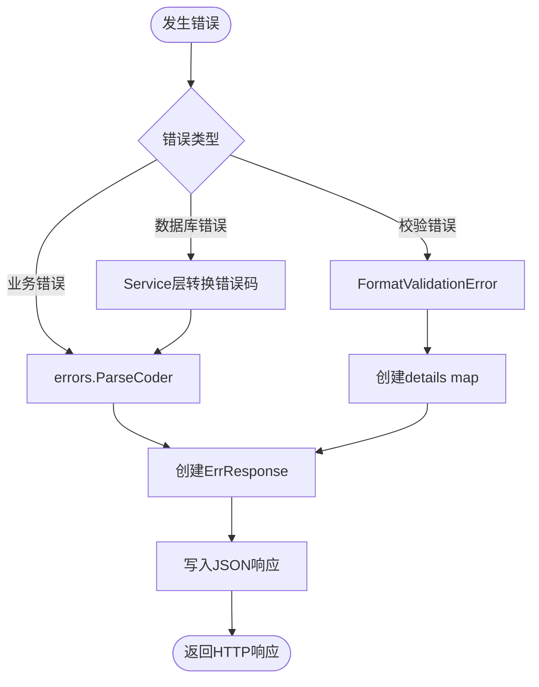
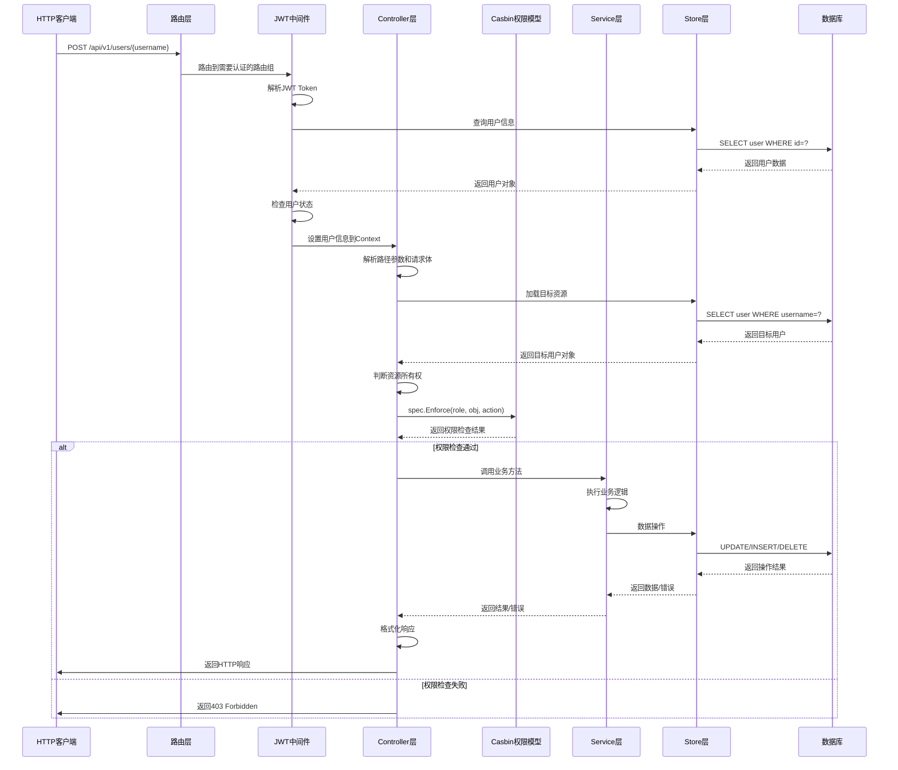
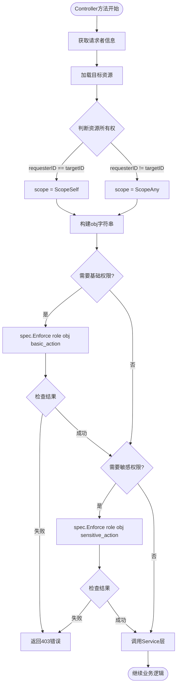
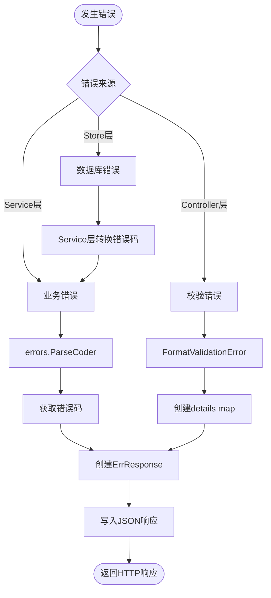

# 项目分层规范（NexusPointWG）

本文档用于规范 NexusPointWG 项目的分层架构，明确各层职责边界，特别强调 controller 层的权限鉴别功能，确保后续开发遵循统一规范。

> **适用范围**：所有后端代码开发，包括新增功能和重构优化。

---

## 1. 架构概览

### 1.1 三层架构

项目采用经典的三层架构模式：

```
┌─────────────────────────────────────────┐
│         Controller 层（控制器层）          │
│  - 权限鉴别（Casbin）                     │
│  - HTTP 请求对接                          │
│  - 服务调用协调                           │
└─────────────────┬───────────────────────┘
                  │
┌─────────────────▼───────────────────────┐
│         Service 层（服务层）             │
│  - 核心业务逻辑实现                       │
│  - 数据校验与转换                         │
│  - 业务规则执行                           │
└─────────────────┬───────────────────────┘
                  │
┌─────────────────▼───────────────────────┐
│         Store 层（数据访问层）            │
│  - 数据持久化                             │
│  - 基础 CRUD 操作                         │
│  - 数据库交互                             │
└─────────────────────────────────────────┘
```

### 1.2 数据流向



### 1.3 各层职责概览

| 层级 | 核心职责 | 禁止事项 |
|------|---------|---------|
| **Controller** | 1. 权限鉴别（Casbin）<br>2. HTTP 请求对接<br>3. 服务调用协调 | 业务逻辑、数据访问 |
| **Service** | 1. 核心业务逻辑<br>2. 数据校验与转换<br>3. 业务规则执行 | 权限判断、HTTP 处理、数据持久化 |
| **Store** | 1. 数据持久化<br>2. 基础 CRUD<br>3. 数据库交互 | 业务逻辑、权限判断、HTTP 相关 |

---

## 2. Store 层规范

### 2.1 职责定义

Store 层是数据访问层，负责：

- **数据持久化**：与数据库进行交互，执行 SQL 操作
- **基础 CRUD 操作**：提供 Create、Read、Update、Delete 等基础数据操作
- **数据查询**：提供各种查询方法（按 ID、按用户名、列表查询等）
- **事务管理**：在需要时管理数据库事务

### 2.2 禁止事项

Store 层**严禁**包含以下内容：

- ❌ 业务逻辑（如密码加密、数据校验规则等）
- ❌ 权限判断（如检查用户是否有权限访问数据）
- ❌ HTTP 相关代码（如 gin.Context、HTTP 状态码等）
- ❌ 业务错误码判断（只返回数据库层面的错误）

### 2.3 接口定义

Store 层通过接口定义，便于测试和替换实现：

**示例：用户数据访问接口**

```go
// internal/store/user.go
type UserStore interface {
    GetUser(ctx context.Context, id string) (*model.User, error)
    GetUserByUsername(ctx context.Context, username string) (*model.User, error)
    CreateUser(ctx context.Context, user *model.User) error
    UpdateUser(ctx context.Context, user *model.User) error
    DeleteUser(ctx context.Context, id string) error
    ListUsers(ctx context.Context, opt UserListOptions) ([]*model.User, int64, error)
}
```

### 2.4 实现示例

参考实现：`internal/store/sqlite/`

**关键要点**：

1. **只返回数据库层面的错误**：如记录不存在、唯一约束冲突等
2. **不进行业务校验**：如密码强度、邮箱格式等应在 Service 层处理
3. **使用 Context**：所有方法必须接受 `context.Context` 参数
4. **返回 Model 对象**：使用 `internal/pkg/model/` 中定义的数据模型

### 2.5 错误处理

Store 层应返回数据库层面的错误，由 Service 层转换为业务错误码：

- 记录不存在 → Service 层转换为 `code.ErrUserNotFound`
- 唯一约束冲突 → Service 层转换为 `code.ErrUserAlreadyExist` 或 `code.ErrEmailAlreadyExist`
- 数据库连接错误 → Service 层转换为 `code.ErrDatabase`

---

## 3. Service 层规范

### 3.1 职责定义

Service 层是业务逻辑层，负责：

- **核心业务逻辑实现**：如用户注册、登录验证、密码加密等
- **数据校验与转换**：验证业务规则，转换数据格式
- **业务规则执行**：如用户状态检查、默认值设置等
- **错误码转换**：将 Store 层的数据库错误转换为业务错误码

### 3.2 禁止事项

Service 层**严禁**包含以下内容：

- ❌ 权限判断（如检查用户是否有权限执行操作）
- ❌ HTTP 请求处理（如 gin.Context、参数绑定等）
- ❌ 响应格式化（如 JSON 序列化、HTTP 状态码等）
- ❌ 直接访问数据库（必须通过 Store 层）

### 3.3 接口定义

Service 层通过接口定义，便于测试和依赖注入：

**示例：用户服务接口**

```go
// internal/service/user.go
type UserSrv interface {
    CreateUser(ctx context.Context, user *model.User) error
    GetUser(ctx context.Context, id string) (*model.User, error)
    GetUserByUsername(ctx context.Context, username string) (*model.User, error)
    UpdateUser(ctx context.Context, user *model.User) error
    DeleteUser(ctx context.Context, id string) error
    ListUsers(ctx context.Context, opt store.UserListOptions) ([]*model.User, int64, error)
}
```

### 3.4 实现示例

参考实现：`internal/service/user.go` 和 `internal/service/auth.go`

**关键代码片段**：

```58:62:internal/service/user.go
func (u *userSrv) UpdateUser(ctx context.Context, user *model.User) error {
	// Database layer already handles errors and returns appropriate error codes
	ensureUserDefaults(user)
	return u.store.Users().UpdateUser(ctx, user)
}
```

**关键要点**：

1. **保持业务逻辑纯净**：只关注业务规则，不涉及权限和 HTTP
2. **错误码转换**：将 Store 层错误转换为业务错误码
3. **数据校验**：在调用 Store 前进行业务规则校验
4. **使用 Model 对象**：输入输出使用 `internal/pkg/model/` 中的模型

### 3.5 错误处理

Service 层必须返回带错误码的 error，使用 `internal/pkg/code` 中定义的错误码：

```go
import (
    "github.com/HappyLadySauce/NexusPointWG/internal/pkg/code"
    "github.com/HappyLadySauce/errors"
)

// 示例：用户不存在
if user == nil {
    return nil, errors.WithCode(code.ErrUserNotFound, "%s", code.Message(code.ErrUserNotFound))
}

// 示例：密码错误
if !passwd.VerifyPassword(password, user.Salt, user.PasswordHash) {
    return nil, errors.WithCode(code.ErrPasswordIncorrect, "%s", code.Message(code.ErrPasswordIncorrect))
}
```

---

## 4. Controller 层规范（重点）

### 4.1 三大核心职责

Controller 层是 API 网关层，承担以下**三大核心职责**：

#### 4.1.1 权限鉴别

使用 Casbin (`internal/pkg/spec`) 进行细粒度访问控制，确保用户只能执行被授权的操作。

#### 4.1.2 HTTP 请求对接

处理 HTTP 请求的解析、响应格式化、错误处理等。

#### 4.1.3 服务调用

作为 Service 层的调用入口，协调业务逻辑执行。

### 4.2 权限控制实现

#### 4.2.1 获取用户信息

从 JWT 中间件获取当前用户信息：

```go
// 从 middleware 获取用户信息
requesterIDAny, ok := c.Get(middleware.UserIDKey)
if !ok {
    core.WriteResponse(c, errors.WithCode(code.ErrTokenInvalid, "missing auth context"), nil)
    return
}
requesterRoleAny, _ := c.Get(middleware.UserRoleKey)
requesterID, _ := requesterIDAny.(string)
requesterRole, _ := requesterRoleAny.(string)
```

#### 4.2.2 确定资源范围（Scope）

根据资源所有权确定 scope：

```go
// 判断是否为资源所有者
scope := spec.ScopeAny
if requesterID != "" && requesterID == targetUser.ID {
    scope = spec.ScopeSelf
}
obj := spec.Obj(spec.ResourceUser, scope)
```

- **`spec.ScopeSelf`**：请求者拥有该资源（如更新自己的信息）
- **`spec.ScopeAny`**：请求者不拥有该资源，或需要全局权限（如管理员操作）

#### 4.2.3 执行权限检查

使用 `spec.Enforce()` 进行权限检查：

```go
// 权限检查
allowed, err := spec.Enforce(requesterRole, obj, spec.ActionUserUpdateBasic)
if err != nil {
    klog.V(1).InfoS("authz enforce failed", "error", err)
    core.WriteResponse(c, errors.WithCode(code.ErrUnknown, "authorization engine error"), nil)
    return
}
if !allowed {
    core.WriteResponse(c, errors.WithCode(code.ErrPermissionDenied, "%s", code.Message(code.ErrPermissionDenied)), nil)
    return
}
```

#### 4.2.4 多重权限检查

对于需要多个权限的操作，依次检查：

```go
// 1) 基础更新权限
allowed, err := spec.Enforce(requesterRole, obj, spec.ActionUserUpdateBasic)
if err != nil || !allowed {
    // 处理错误
}

// 2) 敏感字段更新需要额外权限
if hasSensitive {
    allowed, err := spec.Enforce(requesterRole, obj, spec.ActionUserUpdateSensitive)
    if err != nil || !allowed {
        // 处理错误
    }
}
```

### 4.3 完整示例

参考实现：`internal/controller/user/updateUser.go`

**关键代码片段**：

```76:111:internal/controller/user/updateUser.go
	// --- Authorization (Casbin) ---
	// Determine scope (self/any) based on ownership.
	scope := spec.ScopeAny
	if requesterID != "" && requesterID == existing.ID {
		scope = spec.ScopeSelf
	}
	obj := spec.Obj(spec.ResourceUser, scope)

	// Decide whether this request includes sensitive updates.
	hasSensitive := (req.Password != nil && *req.Password != "") || req.Status != nil || req.Role != nil

	// 1) Basic updates require user:update_basic
	allowed, err := spec.Enforce(requesterRole, obj, spec.ActionUserUpdateBasic)
	if err != nil {
		klog.V(1).InfoS("authz enforce failed", "username", username, "requesterID", requesterID, "requesterRole", requesterRole, "error", err)
		core.WriteResponse(c, errors.WithCode(code.ErrUnknown, "authorization engine error"), nil)
		return
	}
	if !allowed {
		core.WriteResponse(c, errors.WithCode(code.ErrPermissionDenied, "%s", code.Message(code.ErrPermissionDenied)), nil)
		return
	}

	// 2) Sensitive updates additionally require user:update_sensitive
	if hasSensitive {
		allowed, err := spec.Enforce(requesterRole, obj, spec.ActionUserUpdateSensitive)
		if err != nil {
			klog.V(1).InfoS("authz enforce failed", "username", username, "requesterID", requesterID, "requesterRole", requesterRole, "error", err)
			core.WriteResponse(c, errors.WithCode(code.ErrUnknown, "authorization engine error"), nil)
			return
		}
		if !allowed {
			core.WriteResponse(c, errors.WithCode(code.ErrPermissionDenied, "%s", code.Message(code.ErrPermissionDenied)), nil)
			return
		}
	}
```

### 4.4 HTTP 请求处理

#### 4.4.1 参数解析

使用 Gin 的绑定功能解析请求参数：

```go
// 路径参数
username := c.Param("username")

// 请求体绑定
var req v1.UpdateUserRequest
if err := c.ShouldBindJSON(&req); err != nil {
    core.WriteResponseBindErr(c, err, nil)
    return
}

// 查询参数
offsetStr := c.Query("offset")
```

#### 4.4.2 响应格式化

使用 `pkg/core/core.go` 中的统一响应函数：

```go
// 成功响应（带数据）
core.WriteResponse(c, nil, responseData)

// 成功响应（无数据）
core.WriteResponse(c, nil, nil)

// 错误响应
core.WriteResponse(c, err, nil)

// 绑定错误响应（带校验详情）
core.WriteResponseBindErr(c, err, nil)
```

### 4.5 权限检查流程图



### 4.6 禁止事项

Controller 层**严禁**包含以下内容：

- ❌ 业务逻辑实现（应在 Service 层）
- ❌ 直接访问数据库（必须通过 Service 层）
- ❌ 跳过权限检查（所有需要权限的操作必须检查）
- ❌ 硬编码权限判断（必须使用 Casbin）

---

## 5. 错误处理规范

### 5.1 错误码定义

错误码定义在 `internal/pkg/code/` 中：

- **通用错误**：`internal/pkg/code/base.go`（100001-100xxx）
- **业务错误**：`internal/pkg/code/server.go`（110001-110xxx）
- **WireGuard 错误**：`internal/pkg/code/wireguard.go`（120001-120xxx）

### 5.2 响应格式

统一使用 `pkg/core/core.go` 中的响应结构：

**成功响应**：
```json
{
  "code": 100001,
  "message": "OK"
}
```

**错误响应**：
```json
{
  "code": 100003,
  "message": "Validation failed",
  "details": {
    "email": "validation.emaildomain|domains=qq.com,163.com",
    "username": "validation.urlsafe"
  }
}
```

### 5.3 校验错误处理

使用 `FormatValidationError` 生成 i18n token：

```go
// Controller 层
if err := c.ShouldBindJSON(&req); err != nil {
    core.WriteResponseBindErr(c, err, nil)
    return
}
```

`FormatValidationError` 会自动将校验错误转换为 token 格式，前端可解析并进行 i18n 翻译。

### 5.4 错误处理流程图



### 5.5 错误码映射

参考 `docs/api-contract.md` 第 11 章获取完整的错误码映射表。

---

## 6. 数据模型规范

### 6.1 Model 层

**位置**：`internal/pkg/model/`

**用途**：数据库实体定义，用于 Store 层和 Service 层的数据交互。

**示例**：

```go
// internal/pkg/model/user.go
type User struct {
    ID           string    `json:"id" gorm:"primaryKey"`
    Username     string    `json:"username" gorm:"uniqueIndex;not null"`
    Email        string    `json:"email" gorm:"uniqueIndex;not null"`
    PasswordHash string    `json:"password_hash,omitempty" gorm:"column:password_hash;not null"`
    // ...
}
```

### 6.2 Types 层

**位置**：`internal/pkg/types/v1/`

**用途**：HTTP 请求/响应模型，用于 Controller 层的参数绑定和响应格式化。

**示例**：

```go
// internal/pkg/types/v1/user.go
type UpdateUserRequest struct {
    Username *string `json:"username,omitempty" binding:"omitempty,min=3,max=32,urlsafe,nochinese"`
    Email    *string `json:"email,omitempty" binding:"omitempty,email,emaildomain,max=255"`
    // ...
}

type UserResponse struct {
    Username string `json:"username"`
    Nickname string `json:"nickname"`
    Email    string `json:"email"`
}
```

### 6.3 职责分离

| 层级 | 使用 Model | 使用 Types |
|------|-----------|-----------|
| **Store 层** | ✅ | ❌ |
| **Service 层** | ✅ | ❌ |
| **Controller 层** | ❌（需转换） | ✅ |

**转换示例**：

```go
// Controller 层：Types → Model
user := &model.User{
    Username: req.Username,
    Email:    req.Email,
    // ...
}

// Controller 层：Model → Types
resp := v1.UserResponse{
    Username: user.Username,
    Nickname: user.Nickname,
    Email:    user.Email,
}
```

---

## 7. 权限模型规范

### 7.1 Casbin 配置

**模型文件**：`internal/pkg/spec/model.conf`

```conf
[request_definition]
r = sub, obj, act

[policy_definition]
p = sub, obj, act

[role_definition]
g = _, _

[policy_effect]
e = some(where (p.eft == allow))

[matchers]
m = g(r.sub, p.sub) && r.obj == p.obj && (p.act == "*" || r.act == p.act)
```

**策略文件**：`internal/pkg/spec/policy.csv`

```csv
# Admin: full control
p, admin, user:any, *
p, admin, user:self, *

# Regular user: self-scoped only
p, user, user:self, user:update_basic
p, user, user:self, user:soft_delete
p, user, user:self, user:change_password
```

### 7.2 资源定义

**位置**：`internal/pkg/spec/spec.go`

**资源类型**：

```go
type Resource string

const (
    ResourceUser Resource = "user"
    // 可扩展其他资源
)
```

**操作类型**：

```go
type Action string

const (
    ActionUserUpdateBasic     Action = "user:update_basic"
    ActionUserUpdateSensitive Action = "user:update_sensitive"
    ActionUserSoftDelete      Action = "user:soft_delete"
    ActionUserHardDelete      Action = "user:hard_delete"
    ActionUserChangePassword  Action = "user:change_password"
    // 可扩展其他操作
)
```

**范围类型**：

```go
type Scope string

const (
    ScopeSelf Scope = "self"  // 资源所有者
    ScopeAny  Scope = "any"   // 任意资源（管理员权限）
)
```

### 7.3 权限检查

使用 `spec.Enforce()` 进行权限检查：

```go
// 构建对象字符串
obj := spec.Obj(spec.ResourceUser, spec.ScopeSelf)

// 执行权限检查
allowed, err := spec.Enforce(requesterRole, obj, spec.ActionUserUpdateBasic)
```

**参数说明**：

- `sub`：主体（通常是用户角色，如 "admin" 或 "user"）
- `obj`：对象（资源:范围，如 "user:self" 或 "user:any"）
- `act`：操作（如 "user:update_basic"）

### 7.4 权限检查最佳实践

1. **先检查基础权限，再检查敏感权限**：如更新操作先检查 `update_basic`，再检查 `update_sensitive`
2. **根据资源所有权确定 scope**：资源所有者使用 `ScopeSelf`，否则使用 `ScopeAny`
3. **权限检查失败立即返回**：不要继续执行后续业务逻辑
4. **记录权限检查日志**：便于审计和调试

---

## 8. 交互流程图

### 8.1 完整请求处理流程



### 8.2 权限检查详细流程



### 8.3 错误处理流程



---

## 9. 最佳实践

### 9.1 Controller 层权限检查标准模式

**模板代码**：

```go
func (c *Controller) UpdateResource(ctx *gin.Context) {
    // 1. 获取请求者信息
    requesterIDAny, ok := ctx.Get(middleware.UserIDKey)
    if !ok {
        core.WriteResponse(ctx, errors.WithCode(code.ErrTokenInvalid, "missing auth context"), nil)
        return
    }
    requesterRoleAny, _ := ctx.Get(middleware.UserRoleKey)
    requesterID, _ := requesterIDAny.(string)
    requesterRole, _ := requesterRoleAny.(string)

    // 2. 加载目标资源
    targetResource, err := c.srv.Resources().GetResource(context.Background(), resourceID)
    if err != nil {
        core.WriteResponse(ctx, err, nil)
        return
    }

    // 3. 确定资源范围
    scope := spec.ScopeAny
    if requesterID != "" && requesterID == targetResource.OwnerID {
        scope = spec.ScopeSelf
    }
    obj := spec.Obj(spec.ResourceXXX, scope)

    // 4. 执行权限检查
    allowed, err := spec.Enforce(requesterRole, obj, spec.ActionXXXUpdate)
    if err != nil {
        klog.V(1).InfoS("authz enforce failed", "error", err)
        core.WriteResponse(ctx, errors.WithCode(code.ErrUnknown, "authorization engine error"), nil)
        return
    }
    if !allowed {
        core.WriteResponse(ctx, errors.WithCode(code.ErrPermissionDenied, "%s", code.Message(code.ErrPermissionDenied)), nil)
        return
    }

    // 5. 调用 Service 层
    // ...
}
```

### 9.2 Service 层保持纯净示例

**正确示例**（`internal/service/user.go`）：

```go
func (u *userSrv) UpdateUser(ctx context.Context, user *model.User) error {
    // 只包含业务逻辑：设置默认值
    ensureUserDefaults(user)
    
    // 调用 Store 层
    return u.store.Users().UpdateUser(ctx, user)
}
```

**错误示例**（不应在 Service 层）：

```go
// ❌ 错误：Service 层不应包含权限判断
func (u *userSrv) UpdateUser(ctx context.Context, user *model.User, requesterRole string) error {
    if requesterRole != "admin" && requesterRole != "user" {
        return errors.WithCode(code.ErrPermissionDenied, "...")
    }
    // ...
}

// ❌ 错误：Service 层不应处理 HTTP 相关
func (u *userSrv) UpdateUser(c *gin.Context, user *model.User) error {
    // ...
}
```

### 9.3 错误处理最佳实践

1. **统一使用错误码**：所有错误必须使用 `internal/pkg/code` 中定义的错误码
2. **校验错误使用 BindErr**：参数绑定错误使用 `core.WriteResponseBindErr`
3. **业务错误直接返回**：Service 层返回的错误直接传递给 `core.WriteResponse`
4. **记录错误日志**：关键错误点记录日志，便于排查

**示例**：

```go
// Controller 层
if err := c.ShouldBindJSON(&req); err != nil {
    klog.V(1).InfoS("invalid request body", "error", err)
    core.WriteResponseBindErr(c, err, nil)
    return
}

if err := u.srv.Users().UpdateUser(context.Background(), &user); err != nil {
    klog.V(1).InfoS("failed to update user", "error", err)
    core.WriteResponse(c, err, nil)
    return
}
```

### 9.4 代码组织建议

1. **按功能模块组织**：每个功能模块有独立的 controller、service、store
2. **接口优先**：定义接口，便于测试和替换实现
3. **依赖注入**：通过构造函数注入依赖，而非全局变量
4. **单一职责**：每个函数只做一件事

**目录结构示例**：

```
internal/
├── controller/
│   ├── user/
│   │   ├── user.go          # Controller 定义
│   │   ├── createUser.go    # 创建用户
│   │   ├── updateUser.go    # 更新用户（含权限检查）
│   │   └── deleteUser.go    # 删除用户（含权限检查）
│   └── auth/
│       ├── auth.go
│       └── login.go
├── service/
│   ├── service.go           # Service 接口定义
│   ├── user.go              # 用户业务逻辑
│   └── auth.go              # 认证业务逻辑
├── store/
│   ├── user.go              # Store 接口定义
│   └── sqlite/
│       └── user.go          # SQLite 实现
└── pkg/
    ├── model/               # 数据模型
    ├── types/               # HTTP 请求/响应模型
    ├── code/                # 错误码定义
    └── spec/                # 权限模型
```

---

## 10. 开发检查清单

### 10.1 新增接口检查清单

在新增 API 接口时，请确保完成以下检查项：

#### Controller 层

- [ ] **权限检查**：所有需要权限的操作都进行了 Casbin 权限检查
- [ ] **参数解析**：正确解析路径参数、查询参数、请求体
- [ ] **响应格式化**：使用 `core.WriteResponse` 或 `core.WriteResponseBindErr`
- [ ] **错误处理**：所有错误路径都有适当的错误响应
- [ ] **Swagger 注解**：添加完整的 Swagger 注解（@Summary、@Description、@Tags、@Router 等）

#### Service 层

- [ ] **业务逻辑纯净**：不包含权限判断、HTTP 处理代码
- [ ] **错误码转换**：将 Store 层错误转换为业务错误码
- [ ] **数据校验**：在调用 Store 前进行业务规则校验
- [ ] **使用 Model**：输入输出使用 `model` 包中的模型，而非 `types` 包

#### Store 层

- [ ] **只做数据访问**：不包含业务逻辑、权限判断
- [ ] **使用 Context**：所有方法接受 `context.Context` 参数
- [ ] **返回 Model**：返回 `model` 包中的模型对象
- [ ] **错误处理**：返回数据库层面的错误，由 Service 层转换

### 10.2 权限控制检查项

- [ ] **获取用户信息**：从 middleware 正确获取 `UserIDKey` 和 `UserRoleKey`
- [ ] **确定资源范围**：根据资源所有权正确设置 `ScopeSelf` 或 `ScopeAny`
- [ ] **执行权限检查**：使用 `spec.Enforce()` 进行权限检查
- [ ] **多重权限检查**：需要多个权限的操作依次检查
- [ ] **权限检查失败处理**：权限检查失败立即返回 `code.ErrPermissionDenied`
- [ ] **权限检查日志**：记录权限检查失败的日志，便于审计

### 10.3 错误处理检查项

- [ ] **统一错误码**：使用 `internal/pkg/code` 中定义的错误码
- [ ] **校验错误处理**：参数绑定错误使用 `core.WriteResponseBindErr`
- [ ] **业务错误处理**：Service 层返回的错误直接传递给 `core.WriteResponse`
- [ ] **错误日志记录**：关键错误点记录日志
- [ ] **错误响应格式**：符合 `core.ErrResponse` 结构

### 10.4 数据模型检查项

- [ ] **Model vs Types**：Store/Service 层使用 Model，Controller 层使用 Types
- [ ] **数据转换**：Controller 层正确进行 Model ↔ Types 转换
- [ ] **字段校验**：Types 中的请求模型有正确的 `binding` 标签
- [ ] **响应模型**：响应模型只包含前端需要的字段

### 10.5 代码质量检查项

- [ ] **接口定义**：Service 和 Store 层都有接口定义
- [ ] **依赖注入**：通过构造函数注入依赖
- [ ] **单一职责**：每个函数只做一件事
- [ ] **注释完整**：所有公共函数都有完整的注释
- [ ] **错误处理**：所有错误路径都有处理

---

## 11. 总结

### 11.1 核心原则

1. **Controller 层负责权限控制**：所有权限检查必须在 Controller 层完成
2. **Service 层保持业务逻辑纯净**：不包含权限判断、HTTP 处理
3. **Store 层只做数据访问**：不包含业务逻辑、权限判断
4. **统一错误处理**：使用统一的错误码和响应格式
5. **职责分离**：Model 用于数据层，Types 用于 API 层

### 11.2 关键文件引用

- **Controller 示例**：`internal/controller/user/updateUser.go`（权限检查完整示例）
- **Service 示例**：`internal/service/user.go`（业务逻辑纯净示例）
- **Store 接口**：`internal/store/user.go`（数据访问接口定义）
- **权限模型**：`internal/pkg/spec/`（Casbin 配置和资源定义）
- **错误处理**：`pkg/core/core.go`（统一响应格式）
- **错误码**：`internal/pkg/code/`（业务错误码定义）
- **API 规范**：`docs/api-contract.md`（接口对接规范）

### 11.3 后续开发要求

1. **严格遵循本规范**：所有新功能开发必须遵循本规范
2. **代码审查**：在代码审查时检查是否符合规范
3. **持续优化**：根据实际开发经验持续优化规范文档

---

## 12. 自定义验证器规范

### 12.1 验证器定义位置

自定义 HTTP 参数验证器定义在 `pkg/utils/validator/custom.go` 中。

### 12.2 验证器注册

所有自定义验证器必须在 `RegisterCustomValidators` 函数中注册：

```go
// pkg/utils/validator/custom.go
func RegisterCustomValidators(v *v10.Validate) error {
    // 注册验证器
    if err := v.RegisterValidation("tag_name", validateFunction); err != nil {
        return err
    }
    return nil
}
```

### 12.3 现有自定义验证器

项目已实现以下自定义验证器：

| 验证器标签 | 功能说明 | 使用示例 |
|-----------|---------|---------|
| `urlsafe` | 验证字符串只包含 URL 安全字符（字母、数字、下划线、连字符） | `binding:"required,urlsafe"` |
| `nochinese` | 验证字符串不包含中文字符 | `binding:"required,nochinese"` |
| `emaildomain` | 验证邮箱域名在允许列表中 | `binding:"required,email,emaildomain"` |
| `cidr` | 验证 CIDR 格式（支持逗号分隔的多个 CIDR） | `binding:"omitempty,cidr"` |
| `endpoint` | 验证 Endpoint 格式（host:port） | `binding:"omitempty,endpoint"` |
| `ipv4` | 验证 IPv4 地址格式（不含 CIDR） | `binding:"omitempty,ipv4"` |

### 12.4 验证器实现规范

**函数签名**：
```go
func validateXXX(fl v10.FieldLevel) bool {
    value := fl.Field().String()
    if value == "" {
        return true // empty values are handled by required tag
    }
    // 验证逻辑
    return isValid
}
```

**关键要点**：
1. **空值处理**：如果字段为空，返回 `true`（空值由 `required` 标签处理）
2. **错误处理**：验证失败返回 `false`，成功返回 `true`
3. **类型安全**：使用 `fl.Field()` 获取字段值，注意类型转换

### 12.5 错误消息格式化

自定义验证器的错误消息需要在 `pkg/core/core.go` 的 `FormatValidationError` 函数中处理：

```go
// pkg/core/core.go
switch fieldError.Tag() {
case "ipv4":
    message = toToken("ipv4", nil)
// ... 其他验证器
}
```

**Token 格式**：`validation.<tag>|k=v|k2=v2`

- 无参数：`validation.ipv4`
- 有参数：`validation.min|min=8`

### 12.6 添加新验证器步骤

1. **实现验证函数**：在 `pkg/utils/validator/custom.go` 中实现验证逻辑
2. **注册验证器**：在 `RegisterCustomValidators` 中注册
3. **添加错误处理**：在 `pkg/core/core.go` 的 `FormatValidationError` 中添加错误消息格式化
4. **更新文档**：在本规范文档中补充说明

**示例：添加 `ipv4` 验证器**

```go
// 1. 实现验证函数
func validateIPv4(fl v10.FieldLevel) bool {
    value := fl.Field().String()
    if value == "" {
        return true
    }
    ip, err := netip.ParseAddr(value)
    if err != nil {
        return false
    }
    return ip.Is4()
}

// 2. 注册验证器
func RegisterCustomValidators(v *v10.Validate) error {
    // ...
    if err := v.RegisterValidation("ipv4", validateIPv4); err != nil {
        return err
    }
    return nil
}

// 3. 添加错误处理（pkg/core/core.go）
case "ipv4":
    message = toToken("ipv4", nil)
```

### 12.7 验证器使用示例

**在 HTTP 请求模型中使用**：

```go
// internal/pkg/types/v1/wg.go
type CreateWGPeerRequest struct {
    // IPv4 地址验证
    ClientIP string `json:"client_ip,omitempty" binding:"omitempty,ipv4"`
    
    // CIDR 格式验证
    AllowedIPs string `json:"allowed_ips,omitempty" binding:"omitempty,cidr"`
    
    // Endpoint 格式验证
    Endpoint string `json:"endpoint,omitempty" binding:"omitempty,endpoint"`
}
```

**验证失败时的响应**：

```json
{
  "code": 100003,
  "message": "Validation failed",
  "details": {
    "client_ip": "validation.ipv4",
    "endpoint": "validation.endpoint"
  }
}
```

---

**文档版本**：v1.1  
**最后更新**：2025-01-XX  
**维护者**：开发团队

